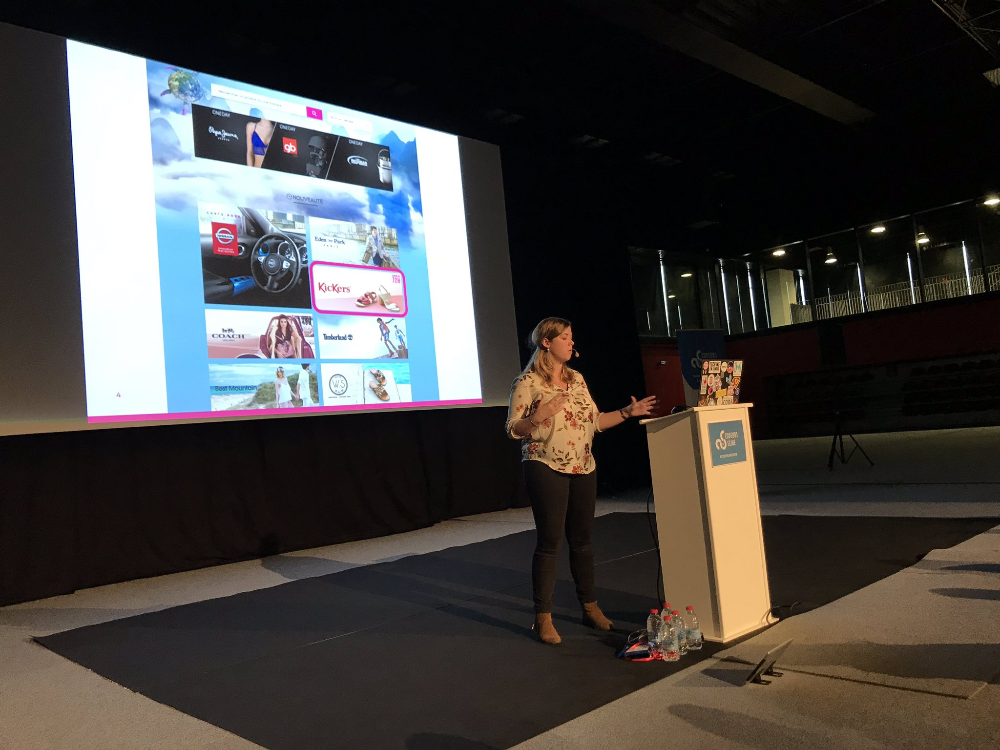

# Titre

## Cartouche d'identification

 - Manifestation : CodeursEnSeine 2018
 - Lieu : Université de Rouen - site du Madrillet
 - Conférence : Système de recommandation
 - Horaire de la conférence : 12h
 - Durée de la conférence : 15mn
 - Conférencier(s) :
   - Betty Moreschini https://twitter.com/bettymoreschini
 - Audience : ~60
 - Auteur du billet : Hugo LEROGERON
 - Mots-clés Recommandation, Ventes, Architecture
 - URL de l'illustration : 

## Support
 - Nombre de diapos du support : Non dispo
 - Plan du support : 
  -L'entreprise
  -La page d'accueil
  -Le modèle de recommandation
  -Les modifications à apporter

## Résumé
La conférence a commencé par une brève explication des activités de l'entreprise de la conférencière. Ventes-privées est un site commerçant permettant à ses clients l'accès à des ventes-privées, c'est à dire des marques proposant leur produits à des prix réduits pendant une durée déterminée. 

Ensuite, la page d'accueil du site a été présentée. C'est un élément central du système de recommandation car c'est sur celle-ci que le système sera appliqué. Le but est de mettre en avant les marques les plus intéressantes pour le client car plus celui-ci fait défiler la page, moins il a de chances d'acheter. Le système, actuellement en A/B test, présente des résultats prometteurs: +4% d'entrée en vente et +2.3% de vente conclue pour les clients concernés. 

Le système fonctionne via un enregistrement des opérations utilisateurs effectuées, puis via machine learning, le but est de prédire les valeurs manquantes, c'est à dire les produits que le client n'a pas encore consulté et de déterminer lesquels pourraient l'intéresser. 

Le système se heurte pour le moment à certaines difficultés. En effet, l'électroménager est de loin la catégorie de produit la plus vendue et a tendance à trop influencer la prédiction des autres catégories. De plus, la répartition des articles en genre est parfois mauvaise dans certains cas.   

## Architecture et facteur qualité
...
